# Modeled-TIM-APP
## Android studio仿AIM实现
####    注册功能
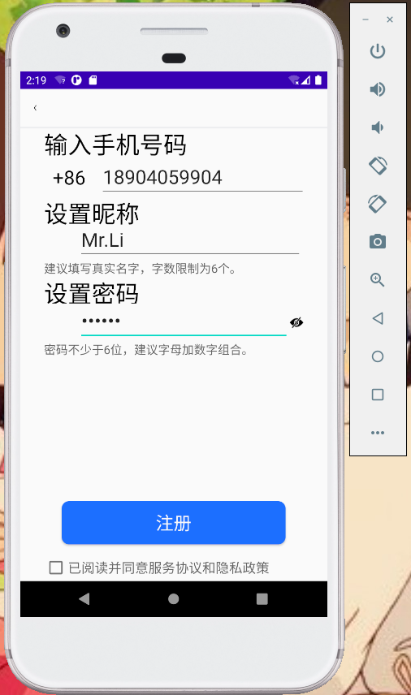
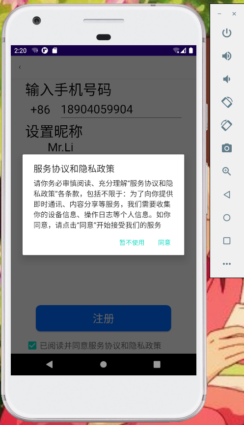
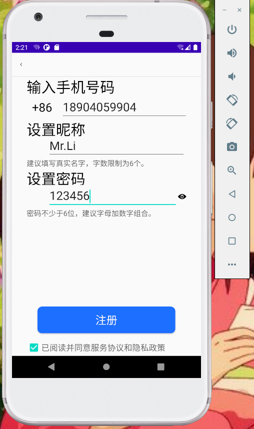
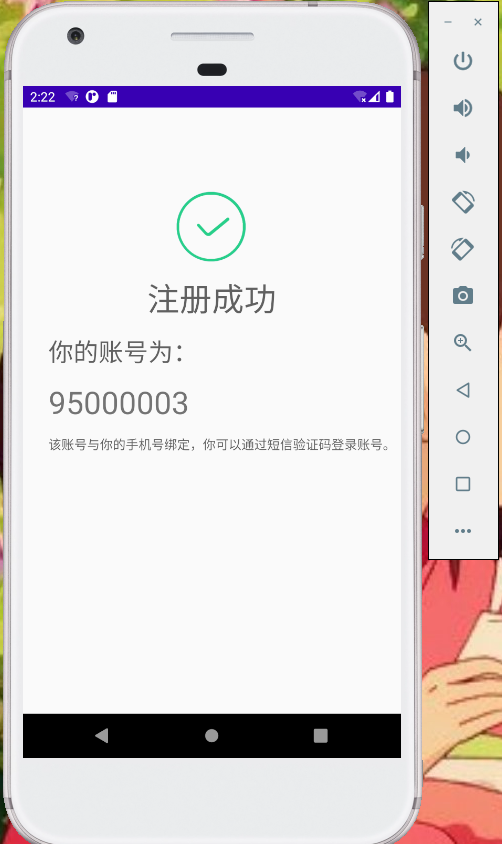
       
####	登录功能及查看登录账号列表
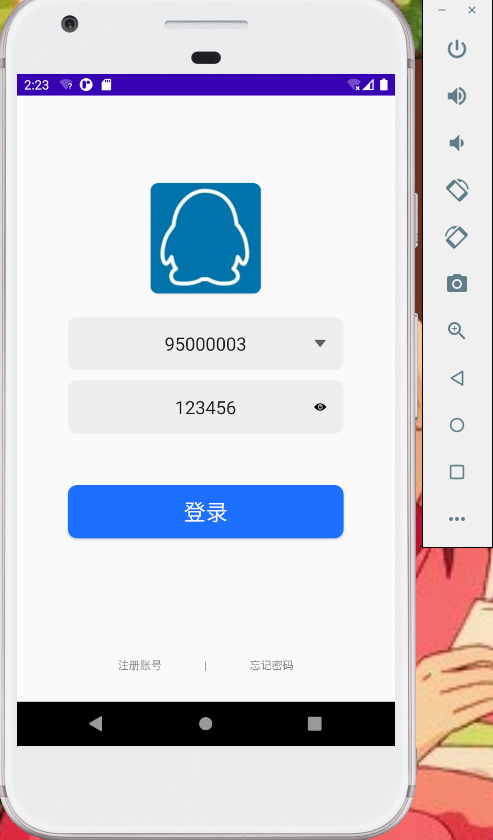
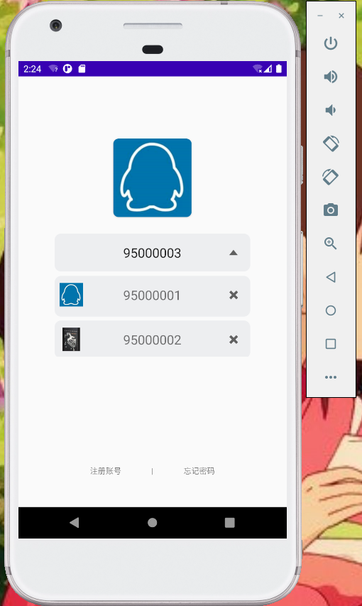

####	用户设置头像功能
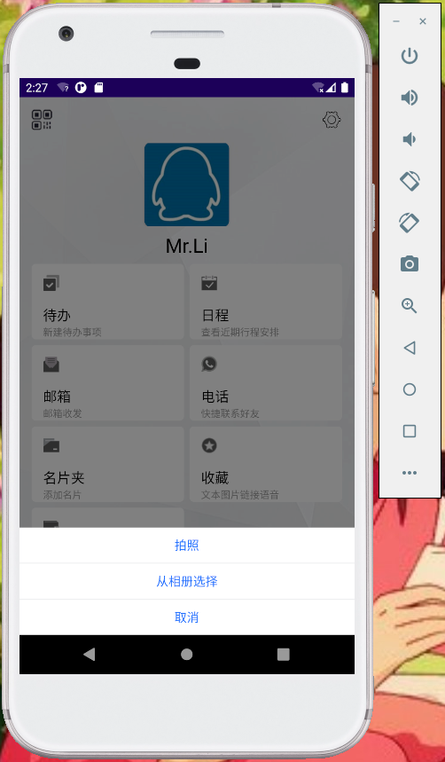
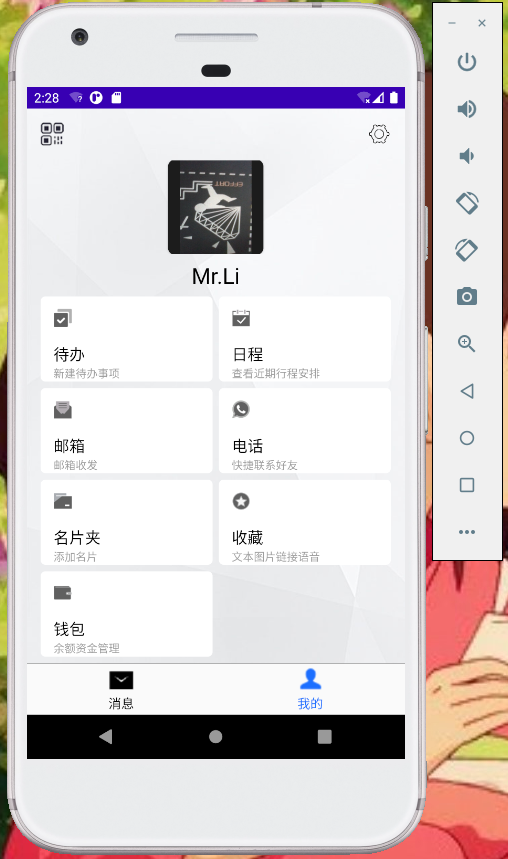
   
####	用户获取系统的联系人手机号码及拨打号码

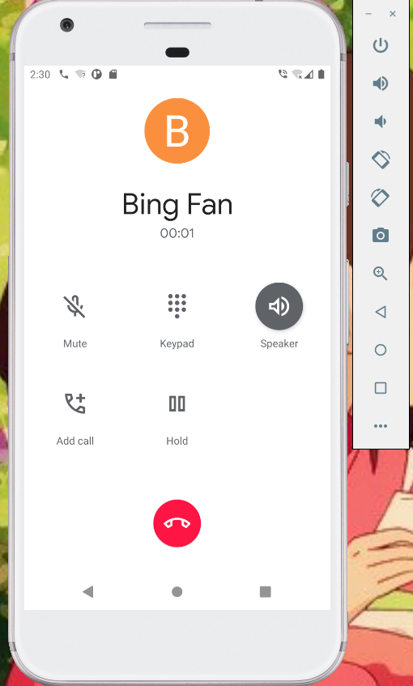
    
####	拨打号码后显示通话记录
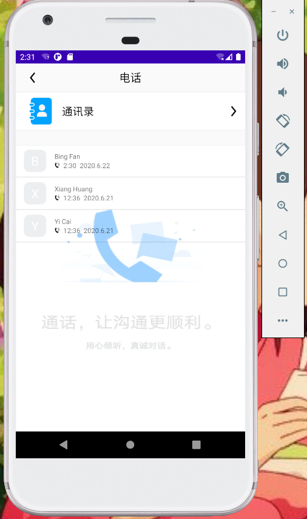
 
####	设置强制下线功能
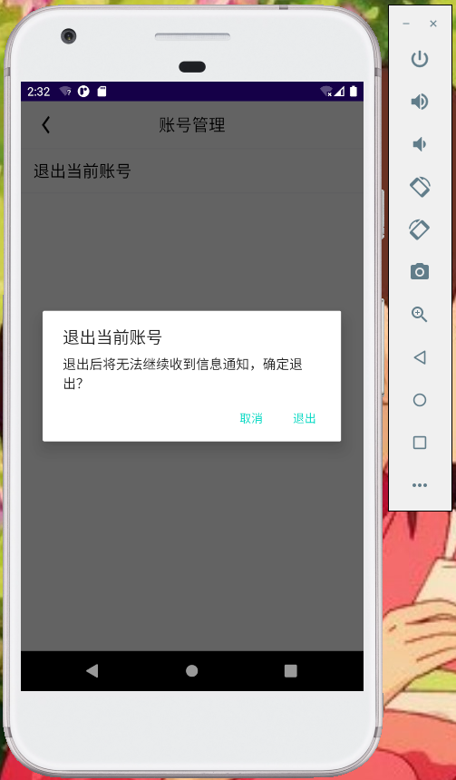
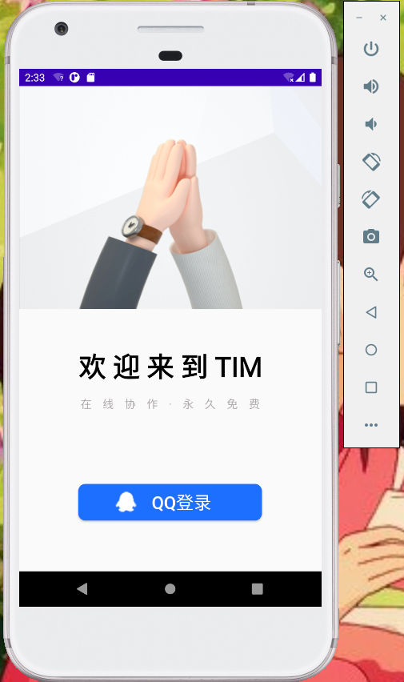
  
####	设置好友列表
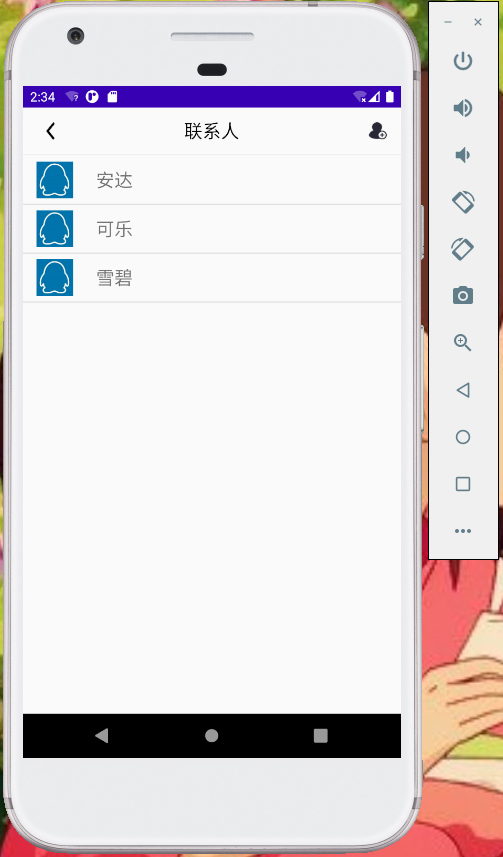
 
####	设置好友信息
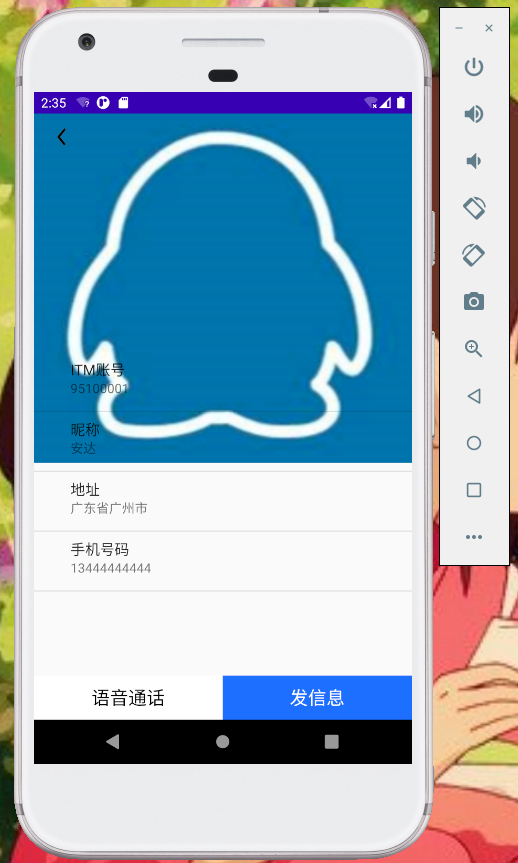
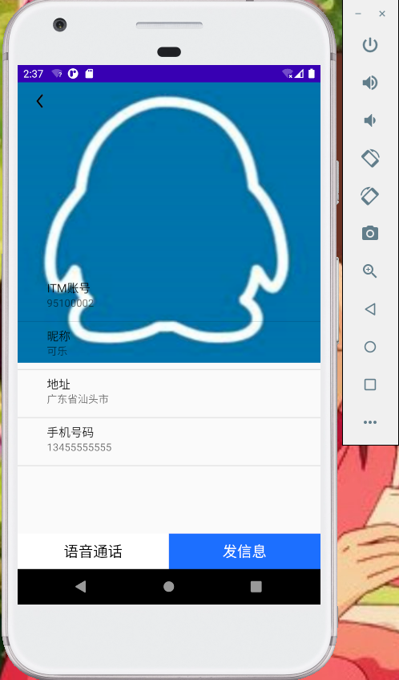
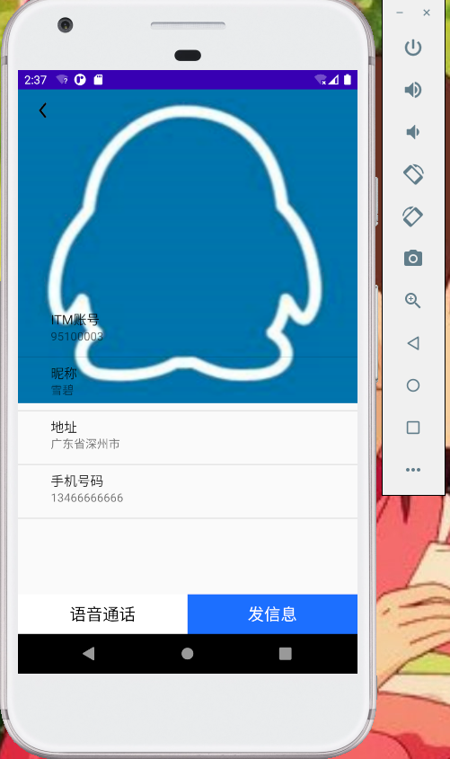
   
####	与好友聊天
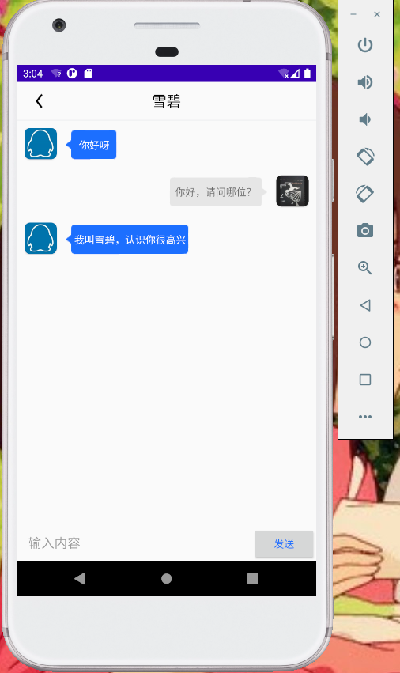
 
####	聊天结束后显示聊天信息框并可以进去查看聊天记录与聊天
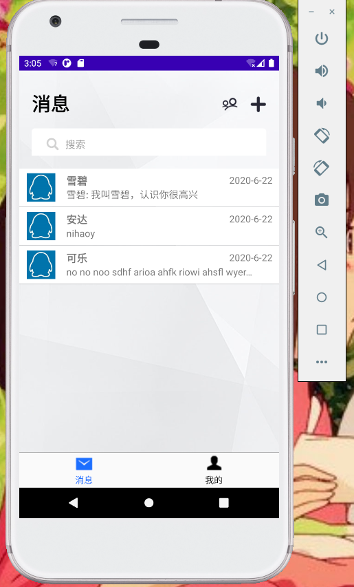
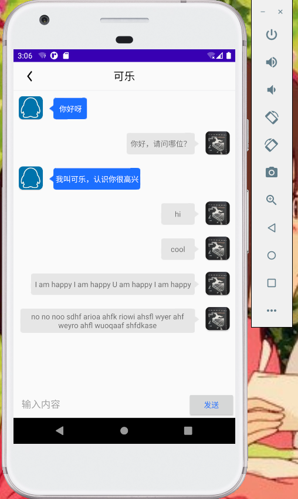
  
